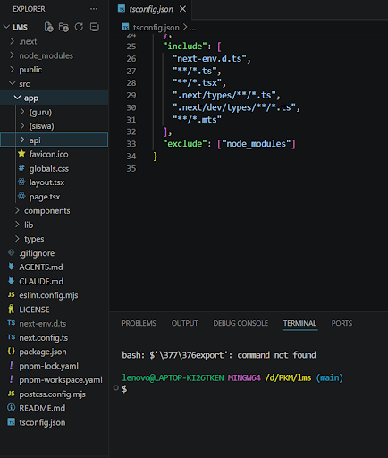
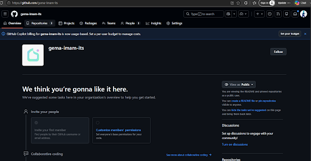
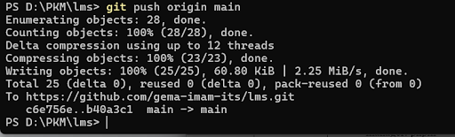
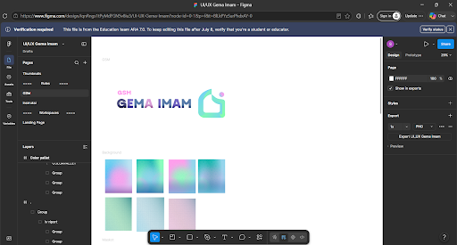
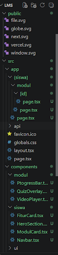
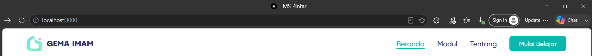

# 📚 Logbook Pengembangan LMS

Dokumen ini berisi rekam jejak (*logbook*) progres pengembangan platform Learning Management System (LMS).

---

## 📅 27 Juni 2026 (15.30 - 17.00)

### 🏗️ Perencanaan & Arsitektur
- Mapping kebutuhan fitur LMS (Prioritas 1, 2, dan 3)
- Menentukan *tech stack* final
- Merancang skema *database*
- Menentukan strategi *hosting* (4 bulan menggunakan VPS, kemudian hibah ke Raspberry Pi)
- Memilih *package manager*: **pnpm**

### 🚀 Setup Project
- Membuat GitHub Organization `gema-imam`
- Inisialisasi **Next.js 14** (App Router + TypeScript + Tailwind CSS)
- Migrasi dari `npm` ke `pnpm`
- Instalasi *dependencies* utama:
  - `@supabase/supabase-js`
  - `@supabase/ssr` *(pengganti auth-helpers yang sudah deprecated)*
  - `cloudinary`
  - `lucide-react`
  - `clsx` & `tailwind-merge`
- Membuat struktur folder lengkap (`siswa`, `guru`, `api`, `components`, `lib`)

**📸 Bukti Dokumentasi:**  

---

## 📅 28 Juni 2026

### ⚙️ Manajemen Repositori
- Setup GitHub *organization* untuk `gema-imam`
- Melakukan *push commit* untuk struktur repositori awal ke GitHub

**📸 Bukti Dokumentasi:**  
 
  
 

---

## 📅 30 Juni 2026

*(Tidak ada aktivitas)*

---

## 📅 1 Juli 2026

### 🎨 Desain UI/UX
- Setup UI/UX `gema-imam` di **Figma**
- Mendefinisikan GSM (Global Style Management), *rules*, dan *references*

**📸 Bukti Dokumentasi:**  

---

## 📅 2 Juli 2026

### 🔄 Redesign Sistem
- Melakukan *redesign* sistem dan struktur teknikal
- Menentukan konten yang akan ditampilkan di *website* serta mematangkan konsep dasar *website*

**📸 Bukti Dokumentasi:**  

---

## 📅 4 Juli 2026

### 💻 Setup Frontend & Bug Fixing
- **Navbar**: Setup komponen Navbar menggunakan Semantic HTML (`<nav>`, `<header>`, dll.) dipadukan dengan desain dari Tailwind CSS.
- **TypeScript Fix**: Memperbaiki masalah *type* `any` pada parameter `children` di file `layout.tsx`.
- **Styling Fix**: Memperbaiki isu *styling* yang rusak akibat hilangnya *import* `globals.css` di `layout.tsx`.
- **Hydration Fix**: Memperbaiki error *hydration mismatch* akibat intervensi ekstensi *browser* (seperti Grammarly) dengan menambahkan atribut `suppressHydrationWarning` pada tag `<html>`.
- **Docker Fix**: Menghapus *warning* atribut `version` yang sudah *obsolete* di file `docker-compose.yml`.

**📸 Bukti Dokumentasi:**  

---
