# Logbook Pengembangan LMS

| Tanggal Kegiatan | Deskripsi Kegiatan | Bukti |
| :--- | :--- | :--- |
| **27 Juni 2026** 15.30 - 17.00 | **Perencanaan & Arsitektur** - Mapping kebutuhan fitur LMS (prioritas 1, 2, 3) - Menentukan tech stack final - Merancang skema database - Menentukan strategi hosting (4 bulan VPS → hibah ke RPi) - Memilih package manager: pnpm  **Setup Project** - Membuat GitHub Organization `gema-imam` - Inisialisasi Next.js 14 (App Router + TypeScript + Tailwind) - Migrasi dari npm ke pnpm - Instalasi dependencies utama:   - `@supabase/supabase-js`   - `@supabase/ssr` (pengganti auth-helpers yang deprecated)   - `cloudinary`   - `lucide-react`   - `clsx` + `tailwind-merge` - Membuat struktur folder lengkap (siswa, guru, api, components, lib) | 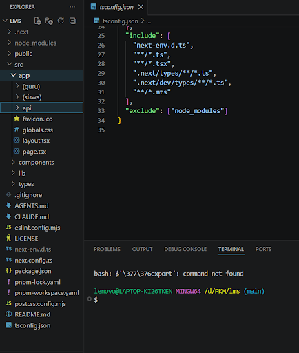 |
| **28 Juni 2026** | - Setup GitHub organization `gema-imam`. - Melakukan push commit awal untuk struktur repository ke GitHub. | 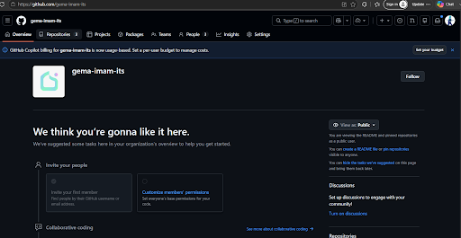 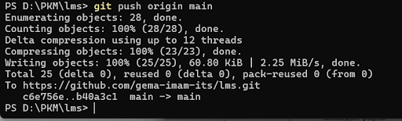 |
| **30 Juni 2026** | - | - |
| **1 Juli 2026** | - Setup UI/UX `gema-imam` di Figma. - Mendefinisikan Global Style Management (GSM), aturan desain, dan referensi. | 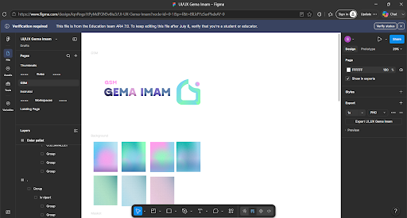 |
| **2 Juli 2026** | - Redesign sistem dan penyesuaian struktur teknikal. - Menentukan alur konten yang akan ditampilkan di web serta konsep dasar aplikasi. | 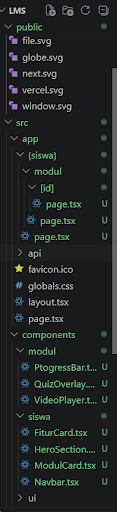 |
| **4 Juli 2026** | **Setup Frontend & Bug Fixing** - Mengimplementasikan Navbar responsif dengan Semantic HTML dan Tailwind CSS. - Memperbaiki isu *type safety* pada parameter `children` di Root Layout. - Memperbaiki konfigurasi *styling* global dengan mengembalikan *import* CSS utama. - Menangani error *hydration mismatch* akibat intervensi ekstensi browser. - Menghapus atribut *obsolete version* pada `docker-compose.yml`. | 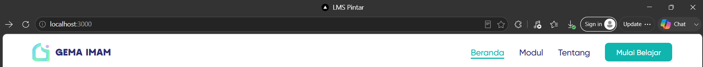 |
| **5 Juli 2026** | **Draft LMS & Pengembangan Komponen UI** - Pembuatan Landing Page (`page.tsx`) dan halaman Tentang (`tentang/page.tsx`). - Implementasi Navbar interaktif dan aksesibel (menggunakan ikon `lucide-react`). - Pembuatan komponen *HeroSection*, *FiturCard*, dan *ModulCard* dengan *styling* yang disesuaikan (WCAG AA). - Pengembangan komponen *VideoPlayer* inklusif (dukungan *Subtitle* CC, fitur *Picture-in-Picture* Bahasa Isyarat, dan sistem *checkpoints*). - Manajemen struktur *assets* gambar dan konfigurasi *custom background* pada Tailwind CSS (`globals.css`). | 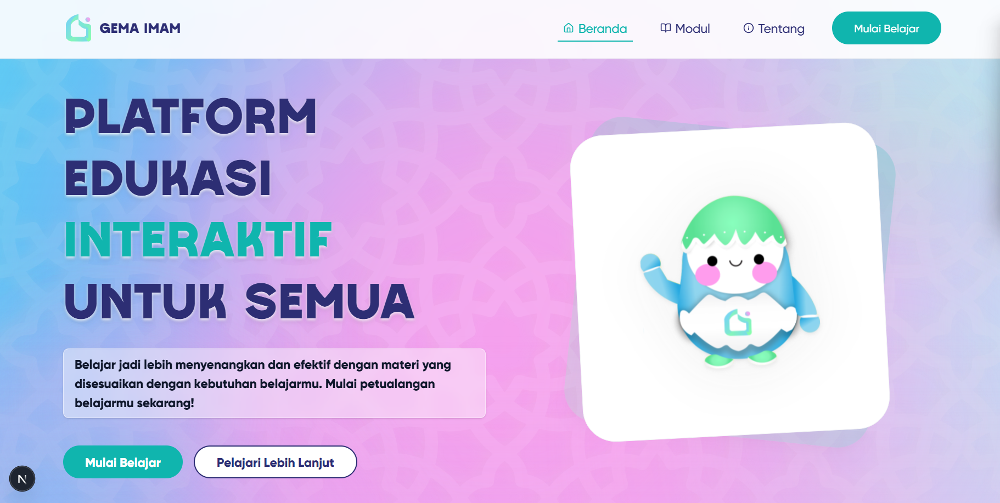 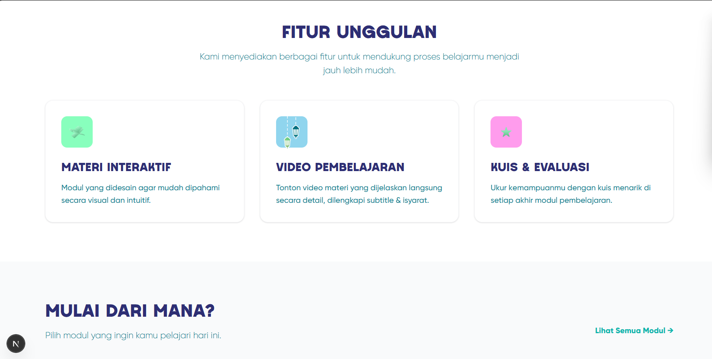 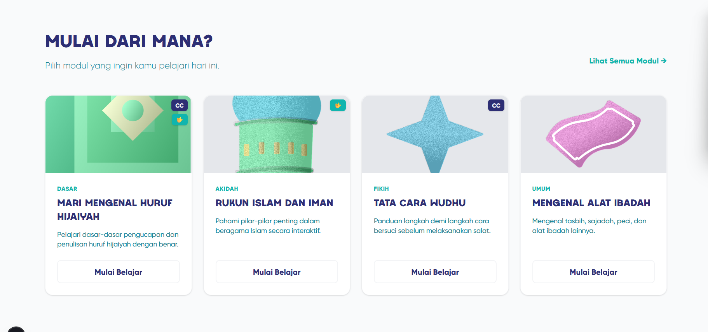 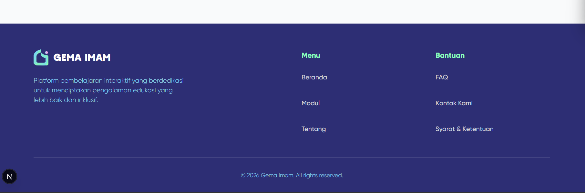 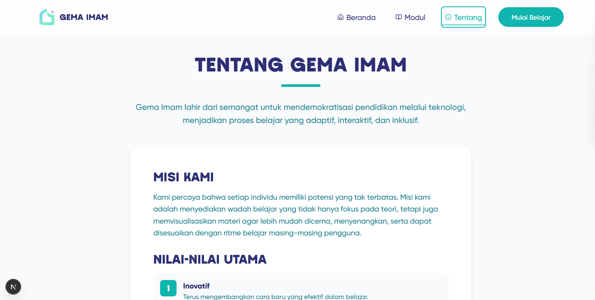 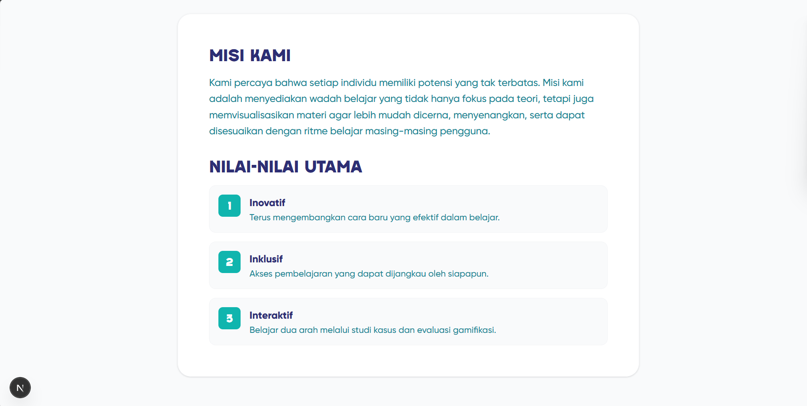 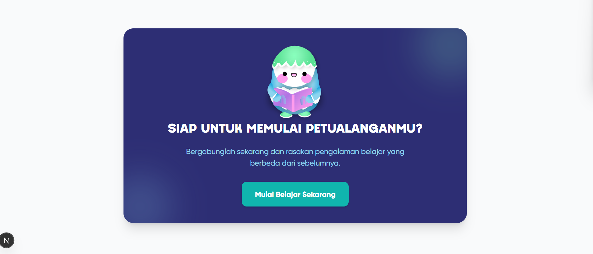 |
| **13 Juli 2026** | **Modul Pembelajaran Interaktif & API IoT Awal** - Membangun halaman katalog modul (`/modul`) dan slide player (`/modul/[id]`) pertama, lengkap dengan gambar gerakan sholat (`gerakan-berdiri`, `-rukuk`, `-sujud`, `-duduk`, `-itidal`, `-sedekap`, `-salam`) dan formasi jamaah (`formasi-imam`, `-jamaah`, `-makmum`). - Menambahkan dokumentasi kontrak teknis integrasi Orange Pi (`integration_technical_specification.md`). - Membuat endpoint awal `/api/iot/gerakan`, `/api/iot/media/upload`, dan `/api/iot/sesi/mulai` untuk menerima data dari perangkat IoT. - Menambahkan berkas pengujian API manual (`scripts/test-api.http`) dan flowchart arsitektur LMS. |   |
| **14 Juli 2026** | **Pengembangan UI Rapor Praktik & Kontrol Sesi** - Membangun halaman rapor siswa (`/rapor`, `/rapor/siswa/[id]`, `/rapor/sesi/[id]`) dan mekanisme *polling* status standby dari Orange Pi. - Menyesuaikan API `sesi/selesai` agar dapat menerima payload *bulk* dari AI/Orange Pi sekaligus. - Menambahkan tombol *force cancel* sesi, hapus sesi individual, dan hapus keseluruhan sesi. - Memperbaiki error TypeScript pada inferensi relasi Supabase dan komponen `VideoPlayer`.  **Pengerasan (Hardening) Data dari Orange Pi** - Mengoreksi pemetaan skema `movement_logs` untuk payload dari AI. - Menyanitasi `exit_time`, `entry_time`, dan sudut numerik yang kadang berupa nilai sentinel (`"-"`) dari Orange Pi agar tidak melanggar batasan kolom TIME/NUMERIC di Supabase. - Menambah teks evaluasi gerakan yang lebih detail beserta timestamp pada tampilan detail sesi. |   |
| **15 Juli 2026** | **Audit Menyeluruh Pipeline IoT & Keputusan Rewrite Spec-Driven** - Mengaudit alur IoT + rapor secara menyeluruh: arsitektur *polling* PENDING/ACTIVE ternyata sudah menyimpang dari spesifikasi *push-based* awal tanpa dibersihkan, menyisakan rute mati, bug urutan status (LIFO, seharusnya FIFO), dan bug nilai sentinel yang merusak urutan waktu gerakan. - Menambahkan RPC `selesaikan_sesi_sholat` agar penyimpanan hasil sesi bersifat atomik, kolom `urutan` dan `exit_reason`, serta penjagaan satu sesi aktif di level database. - Menambahkan fitur pembatalan sesi dari web saat Orange Pi masih merekam. - Menghapus rute-rute *push-based* lama yang tidak pernah dipanggil oleh Orange Pi yang sesungguhnya. - **Keputusan besar:** menyimpan progres lama sebagai referensi (branch `vibecode-reference`), lalu mereset codebase ke *clean slate* untuk memulai penulisan ulang yang *spec-driven* (branch `rewrite/spec-driven`). |   |
| **18 Juli 2026** | **App Shell Rewrite: Navbar Dua Zona, Routing, & Autentikasi Guru** - Membangun fondasi awal `rewrite/spec-driven`: Navbar dua zona (nav siswa: Beranda + Modul, dan gerbang "Guru" terpisah) — *sticky top bar* di desktop, *tab bar* tetap di bawah untuk mobile. - Menyusun struktur *route group* `(siswa)` dan `(guru)`, dengan halaman login di `/masuk`. - Menerapkan autentikasi guru berlapis: Supabase Auth, refresh sesi di `proxy.ts`, pengecekan `requireGuru()` di setiap halaman/aksi server, dan RLS sebagai lapisan terakhir. |   |
| **20 Juli 2026** | **Spesifikasi Modul Pembelajaran & Perbaikan Navbar Mobile** - Menulis spesifikasi lengkap fitur Lessons (`docs/spec/lessons.md`) beserta hasil review PM (`pm-review-lessons.md`). - Menyusun kurikulum 5 modul lengkap dan naskah *voice-over* maskot (`docs/content/`). - Mendefinisikan tipe data lesson baru (`src/types/lesson.ts`). - Memperbaiki `z-index` navbar mobile dan responsivitas modal kuis. |   |
| **21 Juli 2026** | **Perhitungan Skor Server-Side & Perbaikan Navigasi Mobile** - Menampilkan status sesi "Dibatalkan" secara berbeda pada laporan detail sesi, tidak lagi disamakan dengan sesi yang selesai penuh. - Mengubah perhitungan skor sesi agar dihitung sendiri oleh server (bukan mempercayai angka mentah dari Orange Pi) — gabungan kepatuhan tuma'ninah (60%), akurasi postur (25%), dan penalti kesalahan bacaan imam (15%). - Memperbaiki bug menu navigasi mobile yang "terjebak" di dalam kotak navbar akibat `backdrop-blur` menjadi *containing block* untuk elemen `fixed`. |   |
| **23 Juli 2026** | **Setup Docker Produksi** - Menambahkan *setup* Docker produksi (*multi-stage build*, `docker-compose.prod.yml`) untuk *deployment* ke VPS. - Merapikan halaman rapor dan mengganti label skor menjadi "Skor Keseluruhan".  **Rebuild Modul di rewrite/spec-driven (Milestone 1)** - Membangun ulang *engine* Lessons (modul): satu modul penuh dapat dimainkan *end-to-end* — katalog → slide player → kuis *image-choice* → petunjuk saat salah → pengulangan setelah 3x salah → kesempatan terakhir dengan nilai parsial → layar selesai dengan bintang. - Memindahkan (*porting*) halaman rapor beserta seluruh *pipeline* IoT dari `main` ke `rewrite/spec-driven`, sekaligus menutup celah lama "rapor tanpa login" — kini wajib login guru. - Menambahkan fitur hapus siswa pada daftar *roster*, lengkap dengan konfirmasi jumlah sesi yang ikut terhapus. |    |
| **24 Juli 2026** | **Perbaikan Layout Mobile Halaman Detail Rapor** - Memperbaiki lebar header yang tidak penuh di layar mobile (yang turut merusak lebar tombol kembali). - Mengecilkan ukuran gambar maskot dan padding *timeline* yang menumpuk sehingga nyaris tidak menyisakan ruang untuk konten di layar ponsel. - Membiarkan nama gerakan yang panjang membungkus baris, bukan meluber keluar kotak. |  |
| **25 Juli 2026** | **Setup Domain & HTTPS Otomatis dengan Caddy** - Menghubungkan domain `gemaimam.com` ke VPS melalui *DNS A record*. - Menambahkan `Caddyfile` dan layanan `caddy` pada `docker-compose.prod.yml` sebagai *reverse proxy* otomatis untuk HTTPS gratis (Let's Encrypt), sekaligus menutup akses langsung ke port 3000. - Menambahkan dokumen referensi poster pameran. - Memindahkan dokumen spesifikasi modul/kurikulum dari `rewrite/spec-driven` ke `main` agar kedua branch memiliki referensi dokumentasi yang sama. |   |
