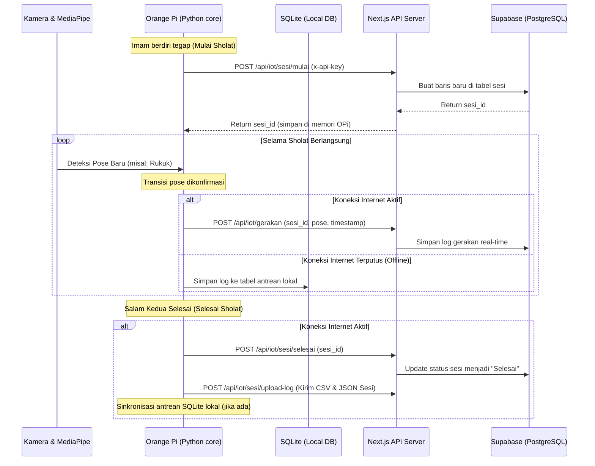
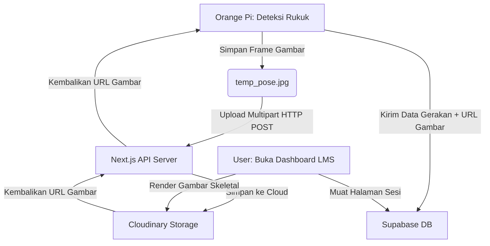

# Dokumen Spesifikasi Teknis & Integrasi Sistem (IoT & Web LMS)
## GEMA Imam — Sholat Tracking System

---

## 1. Arsitektur Sistem & Aliran Data
Sistem **GEMA Imam** terdiri dari dua komponen utama:
1. **Perangkat IoT (Orange Pi 4 Pro)**: Bertindak sebagai agen *edge computing* yang memproses video dari kamera USB secara lokal menggunakan MediaPipe Pose, mendeteksi transisi gerakan sholat, memutar audio panduan, dan mencatat log lokal.
2. **Server Web LMS (Next.js + Supabase)**: Bertindak sebagai *central database* dan dashboard evaluasi yang diakses oleh Guru SLB dan Orang Tua Siswa.

### Diagram Mermaid Aliran Data


---

## 2. Desain Skema Database (Supabase / PostgreSQL)

Untuk menampung data dari Orange Pi, tim Web perlu menyiapkan tabel-tabel berikut di database PostgreSQL Supabase:

### A. Tabel `imams` (Profil Siswa)
Menyimpan profil siswa tunarungu/imam yang terdaftar di SLB.
```sql
CREATE TABLE imams (
    id UUID PRIMARY KEY DEFAULT gen_random_uuid(),
    nama VARCHAR(100) NOT NULL,
    kelas VARCHAR(20),
    created_at TIMESTAMP WITH TIME ZONE DEFAULT TIMEZONE('utc'::text, NOW()) NOT NULL
);
```

### B. Tabel `sholat_sessions` (Metadata Sesi Sholat)
Menyimpan informasi utama satu sesi sholat dari awal hingga akhir.
```sql
CREATE TABLE sholat_sessions (
    id UUID PRIMARY KEY DEFAULT gen_random_uuid(),
    imam_id UUID REFERENCES imams(id) ON DELETE CASCADE,
    nama_sholat VARCHAR(20) NOT NULL, -- Subuh, Dhuhur, dll
    tanggal TIMESTAMP WITH TIME ZONE NOT NULL,
    durasi_detik NUMERIC(5, 1) DEFAULT 0.0,
    status VARCHAR(20) NOT NULL, -- Selesai, Dibatalkan
    total_rakaat INTEGER DEFAULT 0,
    total_kesalahan_imam INTEGER DEFAULT 0,
    skor_tumaninah_persen NUMERIC(4, 1) DEFAULT 0.0,
    created_at TIMESTAMP WITH TIME ZONE DEFAULT TIMEZONE('utc'::text, NOW()) NOT NULL
);
```

### C. Tabel `movement_logs` (Detail Gerakan Per Sesi)
Menyimpan riwayat gerakan demi gerakan di setiap rakaat sholat.
```sql
CREATE TABLE movement_logs (
    id UUID PRIMARY KEY DEFAULT gen_random_uuid(),
    sesi_id UUID REFERENCES sholat_sessions(id) ON DELETE CASCADE,
    rakaat INTEGER NOT NULL,
    nama_gerakan VARCHAR(50) NOT NULL, -- berdiri, sedekap, rukuk, dll
    entry_time TIME NOT NULL,
    exit_time TIME,
    duration_seconds NUMERIC(5, 2),
    tumaninah_terpenuhi BOOLEAN, -- TRUE, FALSE, NULL (untuk gerakan non-tumaninah)
    gerakan_menyimpang TEXT[], -- Array string mencatat jitter gerakan
    hip_angle NUMERIC(4, 1),
    knee_angle NUMERIC(4, 1),
    arm_angle NUMERIC(4, 1),
    foto_pose_url VARCHAR(255) -- Link foto Cloudinary berisi visualisasi deteksi sendi
);
```

---

## 3. Rancangan Tampilan Dashboard Web LMS (Visualisasi Data IoT)

Berdasarkan data sensor gerakan yang dikirim oleh Orange Pi, Website LMS (Next.js) dapat merender dashboard analisis canggih yang dirancang khusus untuk mempermudah tugas evaluasi guru SLB dan orang tua:

### A. Ringkasan Statistik Siswa (KPI Cards)
Menampilkan rangkuman performa ibadah harian/mingguan siswa secara instan:
* **Skor Tuma'ninah Rata-rata**: Persentase gerakan sholat (Rukuk, Sujud, Duduk) yang berhasil dijaga ketenangannya selama $\ge 3$ detik.
* **Tingkat Kepatuhan Sholat**: Rasio jumlah sesi sholat yang diselesaikan secara sempurna dibandingkan total sesi sholat wajib.
* **Total Kesalahan Gerakan**: Jumlah insiden gerakan terburu-buru (mendahului bacaan audio) atau gerakan menyimpang (jitter berlebih) yang terdeteksi.

### B. Grafik Tren & Analisis (Charts & Analytics)
Menggunakan diagram visual untuk melacak perkembangan kognitif dan motorik siswa:
1. **Grafik Garis Tren Tuma'ninah (Line Chart)**:
   * Sumbu X: Tanggal sesi sholat.
   * Sumbu Y: Skor Tuma'ninah (%).
   * *Manfaat*: Guru dapat melihat kurva belajar siswa. Jika grafik terus meningkat, program pembelajaran/terapi terbukti berhasil.
2. **Grafik Donut Distribusi Kesalahan (Donut Chart)**:
   * Menampilkan persentase jenis kesalahan sholat siswa (misal: 60% Rukuk Kurang Membungkuk, 30% Sujud Terlalu Cepat, 10% Gerakan Menyimpang).
   * *Manfaat*: Guru tahu gerakan spesifik mana yang perlu dilatih ulang secara intensif pada siswa tersebut.

### C. Live Class Monitor (Dashboard Guru di Kelas)
Halaman pemantauan langsung ketika sesi praktikum sholat sedang berlangsung di mushola kelas:
* **Live Feed Status**: Kartu nama siswa yang sedang aktif sholat beserta statusnya (misal: "Rakaat 3 - Pose: Bersedekap").
* **Warning Banner**: Jika ada siswa yang posisinya tidak terdeteksi kamera selama > 60 detik, web akan memunculkan alert visual: `"⚠️ Siswa Ahmad keluar dari jangkauan kamera"`.

### D. Lembar Lapor Detail Sesi (Tabel Nilai & Rapor Sholat)
Ketika baris sesi sholat tertentu diklik, sistem akan memuat rincian gerakan sholat per rakaat:
* **Tabel Interaktif**: Baris-baris gerakan sholat diwarnai hijau jika tuma'ninah terpenuhi, dan merah menyala jika terdeteksi terburu-buru (bacaan audio terpotong).
* **Indikator Sudut Sendi**: Menampilkan sudut pinggul (Hip), lutut (Knee), dan lengan (Arm) riil siswa untuk memverifikasi kebenaran postur fisik sholat mereka secara anatomis.

---

## 4. Spesifikasi Kontrak REST API & Format Data

Setiap request dari Orange Pi **wajib** menyertakan header keamanan berikut:
```http
Content-Type: application/json
x-api-key: [SECRET_API_KEY_BERSAMA]
```

### A. POST `/api/iot/sesi/mulai`
Dipanggil saat kamera pertama kali mendeteksi imam berdiri tegak (sholat dimulai).
* **Body Request**:
  ```json
  {
    "imam_id": "8f3b610c-9a4f-4d3e-8c88-6625f385c5c9",
    "nama_sholat": "Dhuhur",
    "timestamp": "2026-07-10T12:00:00Z"
  }
  ```
* **Response Berhasil (200 OK)**:
  ```json
  {
    "success": true,
    "sesi_id": "c9e2b10a-3d2f-4c8d-8e8e-88f2e2d9a1a2"
  }
  ```

### B. POST `/api/iot/gerakan`
Dipanggil secara *real-time* setiap kali state machine mengonfirmasi perubahan gerakan.
* **Body Request**:
  ```json
  {
    "sesi_id": "c9e2b10a-3d2f-4c8d-8e8e-88f2e2d9a1a2",
    "rakaat": 1,
    "nama_gerakan": "rukuk",
    "entry_time": "12:01:05",
    "exit_time": "12:01:10",
    "duration_seconds": 5.0,
    "tumaninah_terpenuhi": true,
    "gerakan_menyimpang": ["Duduk"], -- jika ada gerakan aneh saat ruku
    "hip_angle": 88.5,
    "knee_angle": 175.2,
    "arm_angle": 12.0,
    "foto_pose_url": "https://res.cloudinary.com/demo/image/upload/v1234/pose_rukuk_ahmad.jpg"
  }
  ```
* **Response Berhasil (200 OK)**:
  ```json
  {
    "success": true,
    "message": "Gerakan tersimpan"
  }
  ```

### C. POST `/api/iot/sesi/selesai`
Dipanggil setelah sholat berakhir secara utuh atau dibatalkan di tengah jalan.
* **Body Request**:
  ```json
  {
    "sesi_id": "c9e2b10a-3d2f-4c8d-8e8e-88f2e2d9a1a2",
    "status": "Selesai", -- Selesai | Dibatalkan
    "durasi_detik": 245.0,
    "total_rakaat": 4,
    "total_kesalahan_imam": 1,
    "skor_tumaninah_persen": 85.5
  }
  ```
* **Response Berhasil (200 OK)**:
  ```json
  {
    "success": true,
    "message": "Sesi sholat ditutup"
  }
  ```

---

## 4. Strategi Penanganan Offline (Offline Resiliency)
Masjid atau mushola SLB sering kali memiliki koneksi internet yang tidak stabil. GEMA Imam harus tetap handal dengan menerapkan skema **Offline Queue**:

1. **SQLite Lokal**: Pada Orange Pi, buat database SQLite ringan (`local_queue.db`) yang meniru skema tabel `sholat_sessions` dan `movement_logs`.
2. **Uji Koneksi Sebelum Mengirim**: Sebelum melakukan request HTTP, script Python akan memvalidasi koneksi ke server. Jika gagal (timeout/offline), data akan langsung disimpan di database SQLite lokal.
3. **Mekanisme Auto-Sync**: 
   * Saat program dijalankan kembali atau internet terdeteksi aktif, sebuah thread background akan memindai database SQLite lokal.
   * Jika ada data sesi yang belum terkirim, thread akan mengirimkannya secara berurutan (*FIFO - First In First Out*) ke API server.
   * Setelah sukses terkirim ke cloud, data lokal tersebut dihapus untuk menghemat ruang eMMC Orange Pi.

---

## 5. Rencana Kerja & Roadmap Integrasi (PKM Milestone)

### Milestone 1: Sinkronisasi Kontrak & API (Minggu Ke-1)
* **Goal**: Tim Web dan Tim IoT menyepakati API Key dan format JSON untuk setiap endpoint.
* **Tugas Web**: Deploy server Next.js di VPS dan pastikan endpoint `/api/iot/*` bisa menerima data tiruan (*mock request*) dari Postman.

### Milestone 2: Implementasi `api_client.py` di Orange Pi (Minggu Ke-2)
* **Goal**: Membuat class `APIClient` di Python yang bertugas melakukan request asinkron (`threading`) ke Next.js.
* **Tugas IoT**: Integrasikan client API ini ke dalam [main.py](file:///home/khosy/playground/cv/core/main.py) pada transisi gerakan sholat.

### Milestone 3: Fitur Offline Resiliency (Minggu Ke-3)
* **Goal**: Sistem dapat berjalan lancar tanpa internet, dan data sholat terunggah otomatis saat internet kembali tersambung.
* **Tugas IoT**: Membuat database SQLite lokal dan script sinkronisasi background.

---

## 6. Integrasi Media (Foto Pose Terdeteksi) ke Website

Menampilkan gambar langsung (video streaming) dari kamera ke website secara *real-time* sangat membebani CPU Orange Pi 4 Pro dan menghabiskan kuota internet secara ekstrem.

### Solusi Terbaik (Selective Snapshot Upload):
Sebagai gantinya, sistem menggunakan **pendekatan snapshot selektif**. Setiap kali terjadi perubahan gerakan sholat (misal: dari I'tidal ke Rukuk), Orange Pi akan:
1. **Mengambil Gambar Berwarna** dari frame video pada momen tersebut.
2. **Menggambar Garis Skeleton & Nilai Sudut** pada gambar tersebut (sama seperti yang tampil di layar visualizer).
3. **Menyimpan Gambar Sementara** di Orange Pi: `cv2.imwrite("temp_pose.jpg", frame)`.
4. **Mengirim Gambar ke Server** menggunakan HTTP Multipart Form-Data ke endpoint Next.js: `POST /api/iot/media/upload`.
5. **Next.js mengupload gambar tersebut ke Cloudinary** (sesuai Tech Stack web Anda) dan mengembalikan URL permanen gambar tersebut ke Orange Pi.
6. **Orange Pi menyertakan URL Cloudinary** tersebut ke kolom `foto_pose_url` saat mengirim data ke endpoint `POST /api/iot/gerakan`.

### Visualisasi Alur Media:


### Hasil Akhir di Website LMS:
Di halaman website LMS, ketika guru atau orang tua mengklik rincian gerakan sholat (misal rakaat 1, gerakan "Rukuk"), website akan memuat **kartu foto** yang bersumber dari Cloudinary. Foto tersebut menunjukkan **anak yang sedang rukuk dengan garis kerangka skeletal berwarna hijau dan teks sudut derajat pinggulnya** (seperti `85*` derajat).

Ini memberikan bukti autentik 100% kepada guru dan orang tua mengenai postur fisik sholat murid secara visual dan akurat.

---

## 7. Detail Implementasi Kode & Integrasi Dua Sisi

Berikut adalah rancangan kode konkret yang harus diimplementasikan pada masing-masing repositori untuk mewujudkan fitur *Snapshot Upload* ke Cloudinary secara asinkron.

### A. Repositori IoT (Orange Pi - Python)
Buat modul baru bernama `core/api_client.py` untuk mengurus seluruh request HTTP ke server Next.js di background thread (async):

```python
# core/api_client.py
import requests
import threading
import cv2
import json
import os
import time

# Baca config dari environment variables / config.py
API_URL = "https://gemaimam.com/api"
API_KEY = "nanti_diisi_bersama"  # Sesuai x-api-key

class GemaImamAPIClient:
    def __init__(self):
        self.headers = {
            "x-api-key": API_KEY
        }
        self.sesi_id = None

    def mulai_sesi_async(self, imam_id, nama_sholat):
        """Memulai sesi sholat di background thread."""
        def task():
            try:
                url = f"{API_URL}/iot/sesi/mulai"
                payload = {
                    "imam_id": imam_id,
                    "nama_sholat": nama_sholat,
                    "timestamp": time.strftime("%Y-%m-%dT%H:%M:%SZ", time.gmtime())
                }
                res = requests.post(url, json=payload, headers=self.headers, timeout=10)
                if res.status_code == 200:
                    data = res.json()
                    self.sesi_id = data.get("sesi_id")
                    print(f"[API] Sesi sholat berhasil dimulai. Sesi ID: {self.sesi_id}")
            except Exception as e:
                print(f"[API ERROR] Gagal memulai sesi: {e}")

        threading.Thread(target=task, daemon=True).start()

    def kirim_gerakan_async(self, rakaat, nama_gerakan, transition_info, frame_to_upload=None):
        """Mengirim data gerakan beserta snapshot frame ke Cloudinary."""
        def task():
            if not self.sesi_id:
                print("[API WARNING] Sesi ID tidak aktif. Melewati pengiriman gerakan.")
                return

            foto_url = ""
            # 1. Jika ada frame gambar, upload ke Cloudinary terlebih dahulu
            if frame_to_upload is not None:
                try:
                    # Encode frame opencv (numpy array) ke format JPG di memori
                    success, encoded_img = cv2.imencode('.jpg', frame_to_upload)
                    if success:
                        img_bytes = encoded_img.tobytes()
                        upload_url = f"{API_URL}/iot/media/upload"
                        files = {'file': ('pose.jpg', img_bytes, 'image/jpeg')}
                        
                        res_media = requests.post(upload_url, files=files, headers=self.headers, timeout=15)
                        if res_media.status_code == 200:
                            foto_url = res_media.json().get("url", "")
                            print(f"[API] Foto pose berhasil diunggah: {foto_url}")
                except Exception as media_err:
                    print(f"[API ERROR] Gagal mengunggah foto pose: {media_err}")

            # 2. Kirim data gerakan beserta URL foto
            try:
                url = f"{API_URL}/iot/gerakan"
                payload = {
                    "sesi_id": self.sesi_id,
                    "rakaat": rakaat,
                    "nama_gerakan": nama_gerakan,
                    "entry_time": transition_info.get("entry_time", "-"),
                    "exit_time": transition_info.get("exit_time", "-"),
                    "duration_seconds": transition_info.get("duration_seconds", 0.0),
                    "tumaninah_terpenuhi": transition_info.get("tumaninah_met"),
                    "gerakan_menyimpang": transition_info.get("gerakan_menyimpang", []),
                    "hip_angle": transition_info.get("hip_angle", 0.0),
                    "knee_angle": transition_info.get("knee_angle", 0.0),
                    "arm_angle": transition_info.get("arm_angle", 0.0),
                    "foto_pose_url": foto_url
                }
                # Kirim data JSON gerakan
                res = requests.post(url, json=payload, headers=self.headers, timeout=10)
                if res.status_code == 200:
                    print(f"[API] Log gerakan '{nama_gerakan}' berhasil terkirim.")
            except Exception as e:
                print(f"[API ERROR] Gagal mengirim data gerakan: {e}")

        threading.Thread(target=task, daemon=True).start()

    def selesai_sesi_async(self, summary_info):
        """Menutup sesi sholat secara asinkron."""
        def task():
            if not self.sesi_id:
                return
            try:
                url = f"{API_URL}/iot/sesi/selesai"
                payload = {
                    "sesi_id": self.sesi_id,
                    "status": summary_info.get("status", "Selesai"),
                    "durasi_detik": summary_info.get("durasi_detik", 0.0),
                    "total_rakaat": summary_info.get("total_rakaat", 0),
                    "total_kesalahan_imam": summary_info.get("total_kesalahan_imam", 0),
                    "skor_tumaninah_persen": summary_info.get("skor_tumaninah_persen", 100.0)
                }
                res = requests.post(url, json=payload, headers=self.headers, timeout=10)
                if res.status_code == 200:
                    print(f"[API] Sesi sholat {self.sesi_id} ditutup dengan sukses.")
                self.sesi_id = None  # Reset sesi id
            except Exception as e:
                print(f"[API ERROR] Gagal menutup sesi sholat: {e}")

        threading.Thread(target=task, daemon=True).start()
```

### B. Repositori Web (Next.js - TypeScript)
Buat API Route baru di website Next.js untuk menerima file binary gambar, mengunggahnya ke Cloudinary, dan mengembalikan tautan URL-nya:

```typescript
// app/api/iot/media/upload/route.ts
import { NextRequest, NextResponse } from "next/server";
import { v2 as cloudinary } from "cloudinary";

// Konfigurasi Kredensial Cloudinary (diambil dari .env)
cloudinary.config({
  cloud_name: process.env.CLOUDINARY_CLOUD_NAME,
  api_key: process.env.CLOUDINARY_API_KEY,
  api_secret: process.env.CLOUDINARY_API_SECRET,
});

export async function POST(req: NextRequest) {
  // 1. Validasi API Key
  const apiKey = req.headers.get("x-api-key");
  if (apiKey !== process.env.IOT_SECRET_KEY) {
    return NextResponse.json({ success: false, error: "Unauthorized" }, { status: 401 });
  }

  try {
    // 2. Parse body sebagai FormData (karena mengirim binary file)
    const formData = await req.formData();
    const file = formData.get("file") as File;
    
    if (!file) {
      return NextResponse.json({ success: false, error: "No file uploaded" }, { status: 400 });
    }

    // Convert file ke Buffer
    const arrayBuffer = await file.arrayBuffer();
    const buffer = Buffer.from(arrayBuffer);

    // 3. Upload buffer gambar ke Cloudinary secara stream
    const uploadResult = await new Promise((resolve, reject) => {
      cloudinary.uploader.upload_stream(
        {
          folder: "gema_imam_poses", // Folder di dashboard Cloudinary
          format: "jpg"
        },
        (error, result) => {
          if (error) reject(error);
          else resolve(result);
        }
      ).end(buffer);
    }) as any;

    // 4. Kembalikan URL Cloudinary yang didapat ke Orange Pi
    return NextResponse.json({
      success: true,
      url: uploadResult.secure_url, // URL permanen HTTPS
    });

  } catch (err: any) {
    console.error("Cloudinary upload error:", err);
    return NextResponse.json({ success: false, error: err.message }, { status: 500 });
  }
}
```

---

### Milestone 4: Pembuatan Dashboard LMS di Website (Minggu Ke-4)
* **Goal**: Menampilkan data sholat di halaman web dengan grafik yang informatif dan estetik.
* **Tugas Web**: Membuat visualisasi data menggunakan library chart (seperti Recharts atau Chart.js) di Next.js untuk menampilkan skor tuma'ninah dan histori ibadah siswa SLB.
* **Tugas IoT**: Integrasikan modul penyimpanan gambar lokal dan pengunggahan snapshot pada transisi gerakan kritis sholat.

